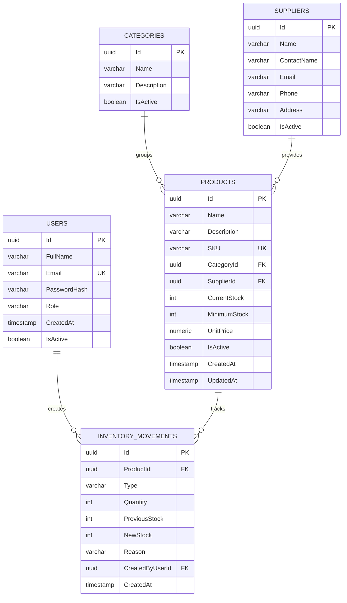

# Database Diagram

## Entities

- **User** stores authenticated system users. Roles are `Admin` and `Employee`.
- **Category** groups products and supports logical deactivation.
- **Supplier** stores vendor contact data and supports logical deactivation.
- **Product** stores SKU, pricing, stock and relationships to category and supplier.
- **InventoryMovement** stores immutable stock history with previous and new stock.

## Relationships

- One category has many products.
- One supplier has many products.
- One product has many inventory movements.
- One user creates many inventory movements.
